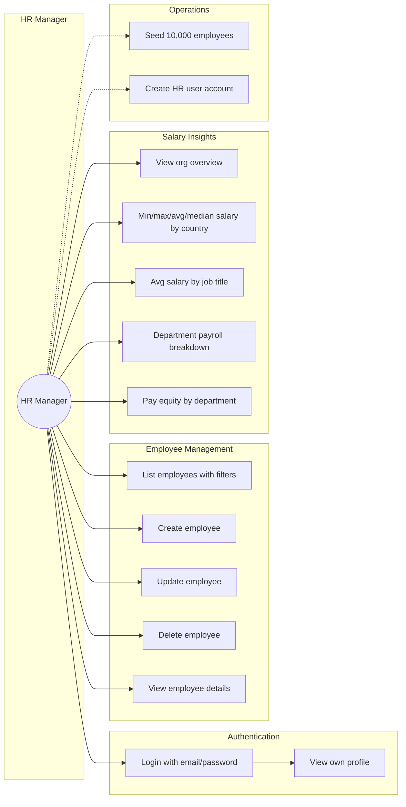
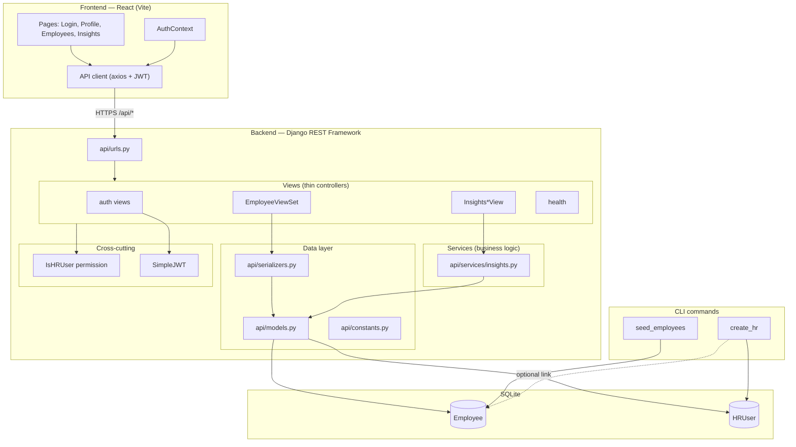
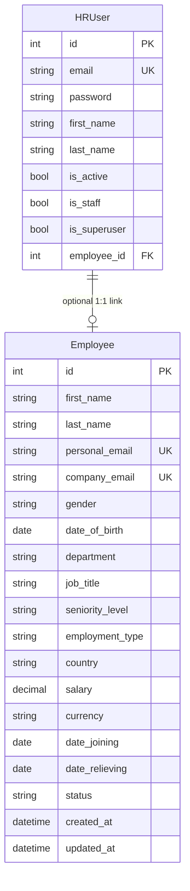

# Salary Management System — Architecture & Design

Minimal end-to-end salary management tool for an organization with ~10,000 employees.

| | |
|---|---|
| **Persona** | HR Manager |
| **Backend** | Django REST Framework + SQLite |
| **Frontend** | React + Vite |
| **Auth** | JWT (SimpleJWT), HR-only access |

---

## User Stories



### Story mapping

| ID | User story | UI route / API |
|----|------------|----------------|
| US1 | As HR, I log in securely | `/login` → `POST /api/auth/login/` |
| US2 | As HR, I see my profile | `/profile` → `GET /api/auth/me/` |
| US3–US7 | As HR, I manage employees (CRUD + filters) | `/employees` → `/api/employees/` |
| US8 | As HR, I see org-wide salary overview | `/insights` (Overview) → `GET /api/insights/overview/` |
| US9 | As HR, I compare salaries by country | By country tab → `GET /api/insights/by-country/` |
| US10 | As HR, I compare avg salary by job title (filterable) | By job title tab → `GET /api/insights/by-job-title/` |
| US11 | As HR, I see department payroll | By department tab → `GET /api/insights/by-department/` |
| US12 | As HR, I review gender pay gaps | Pay equity tab → `GET /api/insights/pay-equity/` |
| US13 | As engineer, I seed 10k employees quickly | `python manage.py seed_employees` |
| US14 | As admin, I create HR accounts | `python manage.py create_hr` |

---

## System Architecture



### Layering

- **Views** — HTTP handling, auth, query params, response shaping
- **Services** — salary aggregation logic for insights (testable in isolation)
- **Serializers** — input validation and API contract
- **Constants** — canonical departments, countries, and job titles

---

## Database Schema



### Indexes and constraints

- `country` — indexed for filter and aggregate queries
- `(country, job_title)` — composite index for job-title insights
- Check constraint: `date_relieving >= date_joining` when relieving date is set
- Unique: `personal_email`, `company_email`, `HRUser.email`

---

## Features

1. **Near-complete backend test coverage (99%)** — see [docs/coverage-report/index.html](docs/coverage-report/index.html), or regenerate with `pytest --cov=api --cov-report=html` in `backend/`.
2. **Query-count regression tests** — `assertNumQueries` on API views, insight services, and management commands to prevent N+1 queries and query inflation over time.
3. **Fast seeding at scale** — `bulk_create` in batches of 1,000 with reproducible `--seed`; query counts verified in tests.
4. **Rich insights beyond baseline requirements** — median salary by country, department payroll totals, seniority breakdown by job title, and pay-equity metrics.
5. **HR-only access** — JWT auth plus `IsHRUser` permission on all employee and insight endpoints.
6. **Validated employee data** — department ↔ job title coupling, country whitelist, and relieving-date business rules enforced in serializers and models.
7. **Production deployment path** — Railway (API) and Vercel/Netlify (frontend) documented in [README.md](README.md).
8. **Layered backend structure** — views → services → models for maintainability and focused unit tests.

---

## Known Limitations

1. **No multi-currency normalization** — All salaries are stored and compared as USD for now. A `currency` field exists on the model but is read-only and defaults to USD. A production system would need a currency conversion layer and base-currency normalization before cross-country insight comparisons are meaningful.

2. **Constants for reference data** — Countries, departments, and job titles are defined in `api/constants.py` rather than admin-managed database tables. This keeps the assessment simple and deterministic; production would use an admin page or UI to manage these lists.

3. **SQLite** — Chosen for zero-config local and dev deployment. Acceptable at ~10k rows; high-concurrency production would prefer PostgreSQL.

4. **Median salary cost** — `get_by_country()` uses two queries: one GROUP BY for aggregates and one scan for per-country salary lists (median computed in Python). SQLite lacks portable `PERCENTILE_CONT`; acceptable at 10k rows.

5. **Single HR role** — No fine-grained RBAC (e.g. read-only HR, country-scoped access).

6. **Backend-focused testing** — Frontend has no automated test suite; API contract is documented in [frontend/docs/API.md](frontend/docs/API.md).

7. **Desktop-only UI** — The frontend is laid out for desktop/window viewports only. It is not responsive for phone or small mobile screens; tables, navigation, and insight charts assume a wide screen. A production rollout would need responsive breakpoints and touch-friendly layouts.

---

## Trade-off Explanations

| Decision | Chosen | Alternative | Why |
|----------|--------|-------------|-----|
| Reference data | Python constants | DB tables + admin UI | Faster to ship; deterministic seed and tests |
| Currency | USD-only assumption | Multi-currency + FX API | Meets insight requirements without FX complexity |
| Database | SQLite | PostgreSQL | Zero-config; sufficient for 10k scale in this exercise |
| Insights | Service module + ORM aggregates | Raw SQL / materialized views | Readable, testable, portable |
| Median calculation | 2-query + Python median | DB window functions | SQLite compatibility; query budget locked in tests |
| Auth | JWT (SimpleJWT) | Session cookies | Stateless; fits SPA on separate frontend host |
| Employee metadata | Denormalized strings | Normalized FK tables | Simpler CRUD and seeding; constants enforce validity |
| Seeding | `bulk_create` batches | Per-row `save()` | Much faster for 10k rows; script runs regularly |
| Validation | Serializer + model `clean()` | DB-only constraints | Clear API error messages for HR-facing forms |

---

## Performance Considerations

### Seeding (10,000 employees)

- `bulk_create` with default batch size **1,000** inside a single transaction
- Reproducible RNG (`--seed 42`) for deterministic test data
- Query-count tests verify batching does not degenerate into per-row inserts

### Insights API query budget

| Endpoint | Service queries | Notes |
|----------|-----------------|-------|
| Overview | 1–2 | Single aggregate + optional country GROUP BY |
| By country | 2 | GROUP BY + salary scan for medians |
| By department | 1 | Single GROUP BY |
| By job title | 1 | GROUP BY `(job_title, seniority_level)` |
| Pay equity | 1 | GROUP BY `(department, gender)` |

All insight endpoints filter **active employees only** (`status=Active`).

View-layer tests add **1 query** for JWT user lookup on top of service queries.

### Employee list API

- Pagination: **25/page** (max 100 via `page_size`)
- Filters applied in the queryset: `departments`, `countries`, `status`
- Query-count tests on list, retrieve, create, patch, and delete

### Database

- Index on `country`
- Composite index on `(country, job_title)`

### Regression prevention

Centralized helpers such as `expected_by_country_query_count()` document expected DB round-trips. Refactors that add queries fail tests immediately.

---

## How to verify

```powershell
# Backend tests + coverage
cd backend
pytest --cov=api --cov-report=html

# Seed 10k employees
python manage.py seed_employees --count 10000 --clear

# Frontend
cd ../frontend
npm run dev
```

---

## AI-assisted development

Built with agentic AI (Cursor) for scaffolding, test generation, documentation, and iteration. Engineering decisions (layering, query budgets, constants vs DB, USD-only currency) were reviewed and adjusted manually. Commit history reflects incremental evolution as required by the assessment.
